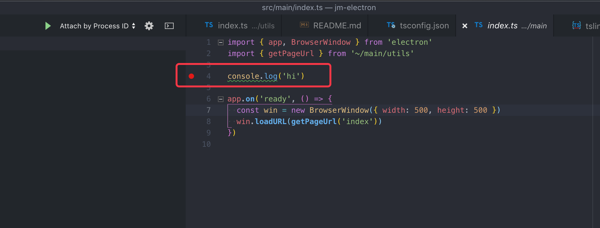
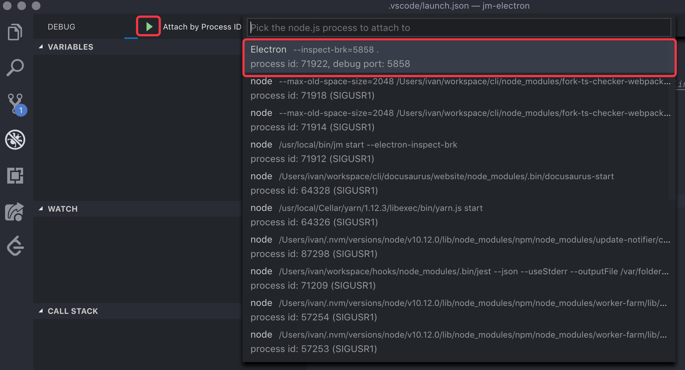
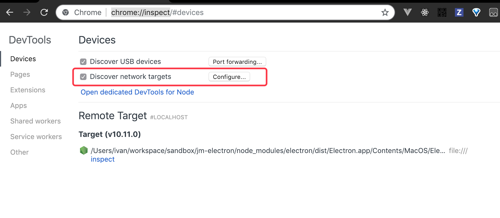

`jm-cli`在`0.4`版本之后支持[`electron`](https://electronjs.org/docs)模式, 可以同时编译主进程(main)和渲染进程(renderer).

## 开启electron模式

通过`electron`配置项打开:

```json
// package.json
{
  "jm": {
    "electron": true
  }
}
```

## 目录结构约定

```shell
.
├── public              # 静态资源目录, 编译后会覆盖到dist目录
├── src                 # 源代码目录.
│   ├── main            # 🔴 主进程代码目录
│   │  ├── index.ts      # 主进程入口
│   │  └── utils
│   │    └── index.ts
│   ├── share                   # 🔴主进程和renderer进程之间的共享代码
│   ├── components              # 🔴可复用组件目录
│   ├── containers              # 🔴页面目录
│   │   ├── Foo                 # Foo页面组件
│   │   │   ├── components      # Foo页面的组件(可选)
│   │   │   ├── model.ts        # Foo页面的外部状态模型(可选)
│   │   │   └── index.tsx       # Foo页面组件入口
│   │   └── Bar
│   ├── utils           # 工具函数目录
│   ├── services        # 服务目录
│   ├── global.css      # 全局样式表
│   ├── foo.tsx         # 🔴入口, 在page.json进行声明
│   ├── bar.tsx
│   └── page.json         # 🔴声明renderer入口和BrowserWindow配置
├── dist                  # 编译输出目录
│   ├── main.js           # 主进程入口. package.json 的main字段指向这个文件
│   ├── foo.html          # renderer 入口, 即页面入口
│   ├── bar.html          # renderer 入口, 支持多页面
│   └── static
├── resources             # electron-builder 构建需要用到的资源
│   ├── icon.icns
│   ├── icon.ico
│   ├── icon.png
│   └── icons
├── output                # electron-builder 构建输出目录
├── global.d.ts           # Typescript全局声明文件
├── package.json
├── tsconfig.json
├── tslint.json
├── README.md
└── yarn.lock
```

和[`Fold Structure`](folder-structure.md)中约定的目录结构的区别在于:

+ 新增的`src/main`目录. 这个目录用于放置electron的主进程. electron进程和
renderers是相互隔离的, 所有main目录下的代码应该尽量避免导入renderer的模块, 尽管
可以编译通过.
+ 新增了`src/share`目录了. 上面提到main目录不应该引用renderer的模块, 所以这里约定
了一个share目录, 用于放置主进程和renderer进程之间共享的模块. 例如一些类型协议, 数据模型对象,
佛那个就方法.
+ 新增了`page.json`文件, 使用这个文件来声明`入口页面`以及对应的`BrowserWindow`配置
+ `dist/main.js` 主进程文件会编译输出到`dist/main.js`文件中, 主进程和renderer进程的文件
是在两个webpack实例中单独编译的. 按照Electron的构建规范, `package.json`的main字段应该
指向这个文件.

## 页面配置

`v0.4`之后支持多种入口配置方式, 而`page.json`的配置方式是专为Electron设计的. 一个`page.json`
文件可以包含以下内容:

```json
{
  "foo": {
    "width": 500,
    "height": 500,
    "minHeight": 400,
    "frame": false,
    "alwaysOnTop": true
  },
  "bar": {
    "width": 500,
    "height": 500,
  }
}
```

**foo**和**bar**都是入口名称, 所以要求必须存在对应的入口文件, 例如`foo.tsx`. 
属性值没有约束, 比如上面的例子就是`BrowserWindow`的配置参数. 有了这些参数就可以用下面的方法
来加载页面:

```ts
// src/main/utils/index.ts
import { resolve } from 'app-root-path'
import { BrowserWindowConstructorOptions, BrowserWindow } from 'electron'
import pageConfig from `~/page.json`

/**
 * 获取页面的根路径
 * + 开发环境指向到开发服务器的
 * + 生产环境使用file协议指向dist目录
 */
const WindowHost = process.env.NODE_ENV === 'development' 
  ? `${process.env.PROTOCOL}://${process.env.ADDRESS}:${process.env.PORT}`
  : `file://${resolve(process.env.DIST)}`

function getPageUrl(name: string) {
  return `${WindowHost}/${name}.html`
}

export function openPage(name: string, config: BrowserWindowConstructorOptions = {}) {
  // 从page.json 中读取配置
  const defaultConfig = pageConfigs[name] || {}
  const win = new BrowserWindow({ ...defaultConfig, ...config })
  win.loadURL(getPageUrl(name))

  return win
}
```

加载页面:

```ts
// src/main/index.ts
import { app, BrowserWindow } from 'electron'
import { openPage } from '~/main/utils'

app.on('ready', () => {
  // 加载foo页面
  openPage('foo')
})
```

## 依赖管理

主进程和renderer进程使用了两种不同的策略进行编译:

**主进程**
所有导入的node_modules模块都不会打包进`dist/main.js`中, 本地模块则会打包进来. 例如:

```ts
// src/main.ts
import { app, BrowserWindow } from 'electron'
import { getPageUrl } from '~/main/utils'

app.on('ready', () => {
  ...
})
```

`electron`是外部模块, 不会打包进最终文件, 而是在运行时进行*require*, 所以主进程代码中导入的
node_modules模块在生产环境中也需要存在的. 打包工具需要将这些模块携带到程序包中.

`~/main/utils`是本地模块, 会编译合并到`dist/main.js`文件中

**renderer进程**
和普通的Web应用一样, renderer进程的所有模块都由webpack进行编译和管理, 所有模块都会打包到输入
目录, 生产环境不需要引用这些模块.

所以我们这里约定, 在electron模式下, 划分三种依赖类型:

+ `dependencies` 生产依赖, 即主进程依赖的模块需要放置在这里.
+ `optionalDependencies` 可选依赖, 在electron模式下放置renderer进程的依赖. `jm-cli`在
开发环境会将这部分的模块生成Dll文件, 来提升编译的速度
+ `devDependencies` 开发依赖, 主要是一些开发构建方面的依赖, 不会被代码引用.

这里通过`yarn`来示范安装这三种依赖模块:

```shell
# 主进程依赖
yarn add electron-is @gdjiami/jsonrpc-electron

# renderer进程依赖, 即页面依赖
yarn add --optional react react-dom

# 开发依赖
yarn add --dev electron @gdjiami/cli
```

## 开发调试

### 主进程调试

#### 日志输出

主进程的console日志会输出到`jm-cli`的命令输出中:


#### 调试

可以使用下列命令开启调试模式:

```shell
# 开启electron调试, 它将会监听 V8 引擎中有关 port 的调试器协议信息. 默认端口是5858, 主机是127.0.0.1
jm start --electron-inspect
# 可以指定自定义端口
jm start --electron-inspect=9222
# 可以指定自定义主机和端口, 主要用于远程调试
jm start --electron-inspect=127.0.0.1:9222

# 和上面一样, 但是会在JavaScript 脚本的第一行暂停运行
jm start --electron-inspect-brk
```

开启调试模式之后, 就可以使用`Chrome调试器`或`Vscode`进行调试:

##### VsCode(💡推荐)

`VsCode`支持Nodejs调试, 具体调试过程和Node程序没有区别:


选择`Add Configuration`添加调试配置, 采用`Attach to process`模式, 附加到electron主程序


接着就可以在代码上设置断点:



接着可以开启调试, 选择需要调试的Electron程序:



---

##### Chrome(55+)

Chrome提供了一个调试器用于调试兼容V8调试协议的程序, 所以支持Electron和Node程序.
在Chrome中地址栏输入`chrome://inspect`



Chrome默认会监听`9222`和`9229`端口的网络调试器, 如果使用非标准端口和远程调试, 可以配置调试主机和端口:


当Chrome监听到调试进程时就会显示出来:


调试过程和普通页面基本一致, 使用`CtrlOrCommand+P`查找对应的调试文件:


**inspect-brk**

inspect-brk主要用于同步调试electron主进程的启动过程, inspect-brk 模式会在第一行Javascript
代码处断点, 需要注意的这个位置是Electron的内核代码, 而不是我们的main.js, 这时候我们自己的模块还没加载进来,
所以如果在Chrome调试器中`CtrlOrCommand+P`是找不到用户的模块的. 需要Electron内核加载主程序后才能查找到:


针对这种场景, 如果你想要在main.js的某一行进行断点, 可以使用`debugger`语句进行断点, 这同时适用于
`inspect`和`inspect-brk`模式, 程序会在`debugger`语句位置暂停, 等待调试

```ts
import { app, BrowserWindow } from 'electron'
import { getPageUrl } from '~/main/utils'

debugger  // 在此处断点
console.log('hi')

app.on('ready', () => {
  const win = new BrowserWindow({ width: 500, height: 500 })
  win.loadURL(getPageUrl('index'))
})
```

---

### renderer页面调试

renderer调试方法和Chrome页面调试方式一致, 在激活的页面可以通过下列快捷键打开控制台:

+ `Ctrl+alt+I` 打开开发者工具
+ `Ctrl+R` 刷新
+ `Shift+Ctrl+R` 强制刷新

> Mac下Ctrl替换成`Command`

也可以命令式打开控制台:

```ts
const win = new BrowserWindow()
win.webContents.openDevTools()
```

**开发者工具扩展**

在前端页面开发时, 通常需要辅助扩展插件来提高开发和调试效率, 社区使用较为广泛的有:

+ [electron-devtools-installer](https://github.com/MarshallOfSound/electron-devtools-installer) 支持自动安装流行的前端框架插件, 如React, Redux, Vue
+ [Devtron](https://github.com/electron/devtron) 用于检查electron本身, 例如模块依赖图, 进程间通信查看, 事件检查, APP文件检查

## 扩展

+ [jm-electron-template](https://github.com/GDJiaMi/jm-electron-template) electron 应用模板
+ [awesome-electron](https://github.com/sindresorhus/awesome-electron)
+ [Electron官方文档](https://electronjs.org/docs)